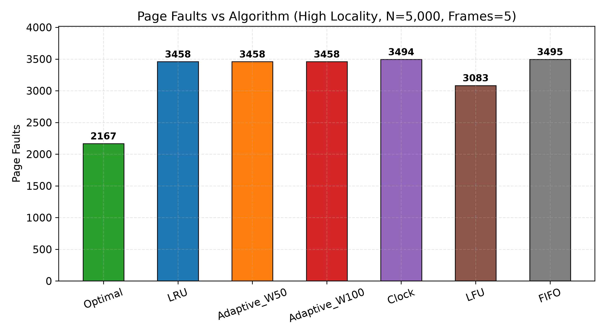
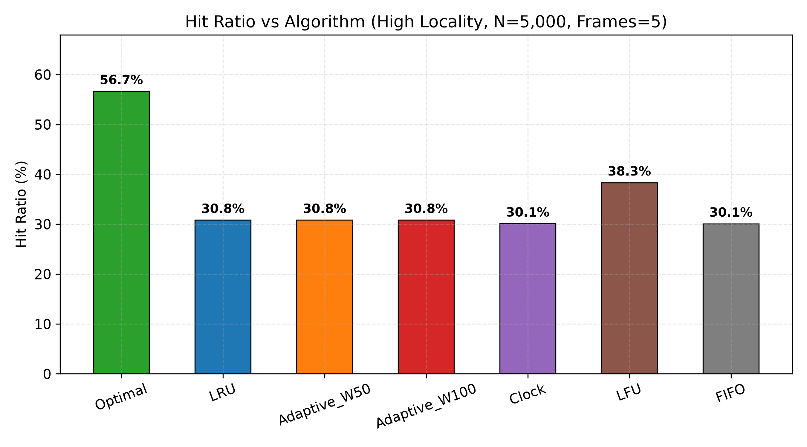
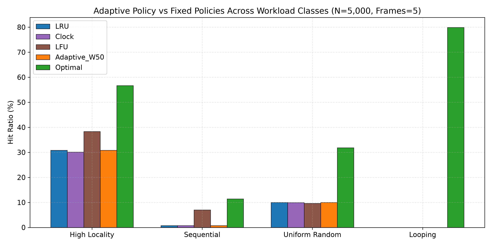
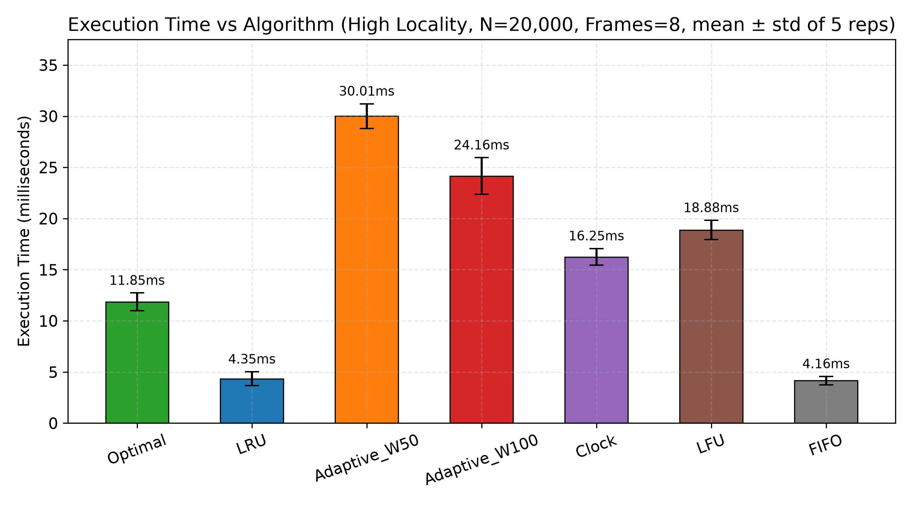
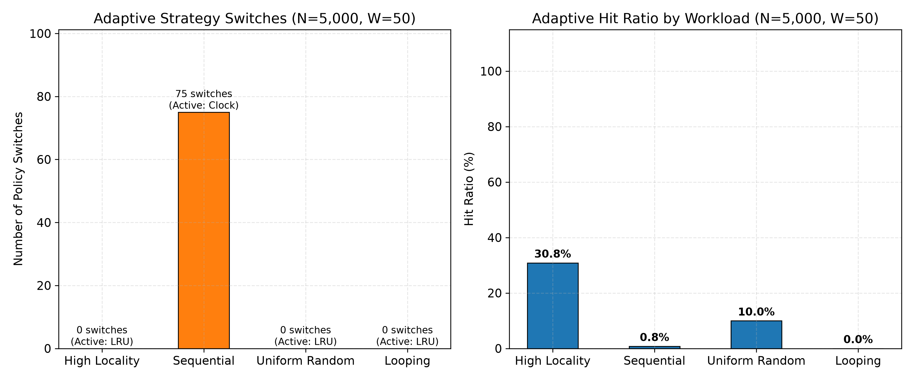
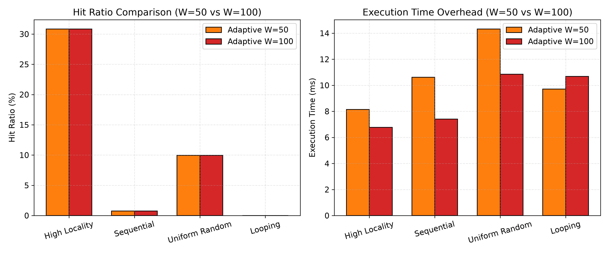
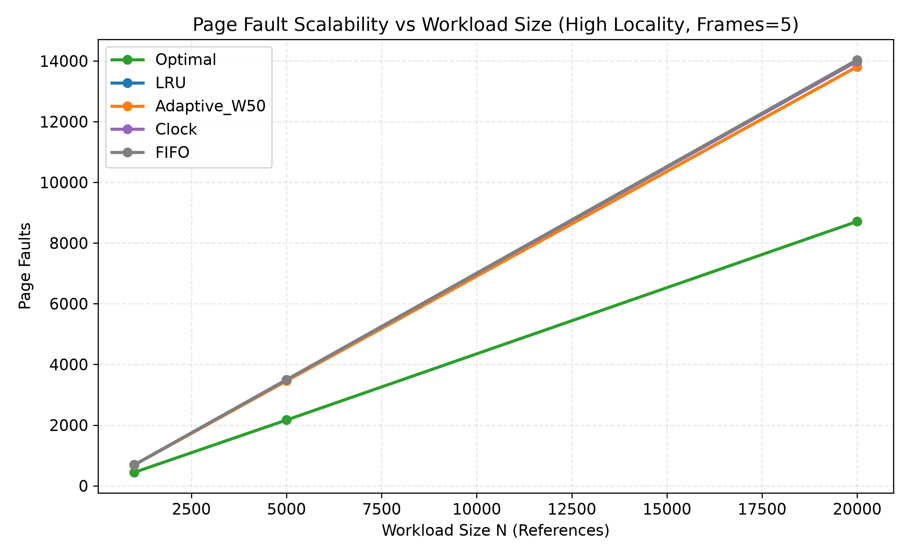
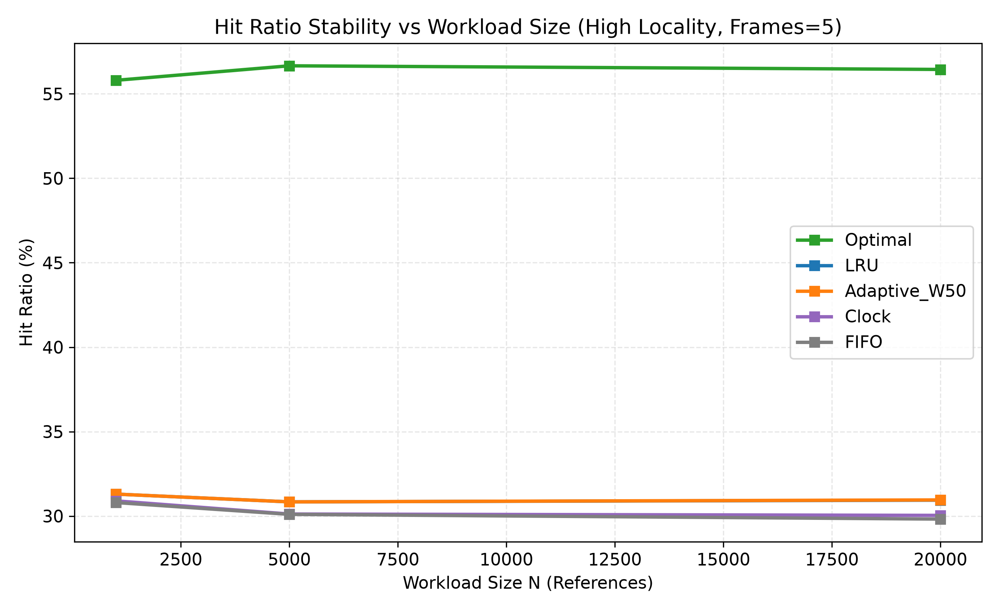
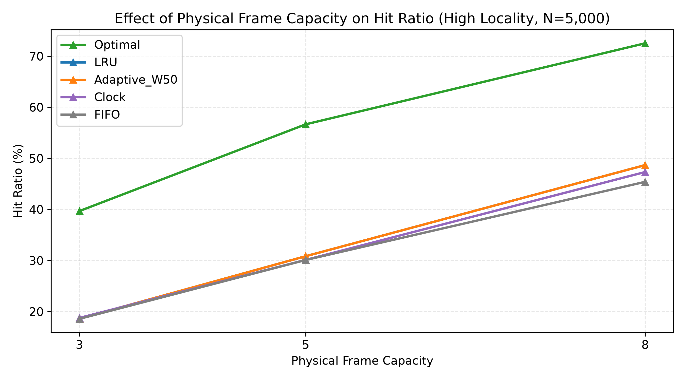

<![CDATA[# ADAPTIVE PAGE REPLACEMENT BASED ON MEMORY-REFERENCE LOCALITY
## An Experimental Evaluation of FIFO, LRU, Optimal, Clock, LFU, and an Online Adaptive Policy

---

**Course:** BCSE303L – Operating Systems  
**Semester:** Fall Semester 2026-27  
**Case Study:** CS3 – Adaptive Page Replacement  

**Students:**  
- 24BCE0702 – Yash Pradhan  
- 24BCE0714 – Anjini Pandey  

**Date:** October 2026

---

## DECLARATION / CERTIFICATE

We hereby declare that this project report titled *"Adaptive Page Replacement Based on Memory-Reference Locality"* is an original piece of work carried out by us for the course BCSE303L – Operating Systems during the Fall Semester 2026-27. The project was designed, implemented, tested, and evaluated as part of our coursework, with all reported numerical results generated from the project's experimental implementation. No results, plots, or data have been fabricated. All numerical values presented in this report are sourced directly from the project's experimental CSV output files.

| | |
|---|---|
| **Student 1** | 24BCE0702 – Yash Pradhan |
| **Student 2** | 24BCE0714 – Anjini Pandey |
| **Faculty / Guide** | __________________ |
| **Date** | __________________ |

---

## ABSTRACT

Virtual memory systems rely on page replacement policies to determine which resident page to evict when physical memory is saturated and a page fault occurs. Classic algorithms such as LRU, LFU, FIFO, and Clock embed fixed assumptions about program behavior — temporal locality, frequency popularity, or arrival order — and suffer systemic degradation when workload access patterns shift. This case study designs, implements, and rigorously evaluates an online, strictly causal **Adaptive Page Replacement** policy that dynamically detects memory-reference locality within a rolling observation window and switches between LRU, Clock, and LFU replacement heuristics without any future lookahead.

We implemented five baseline algorithms (FIFO, LRU, Optimal/Belady's MIN, Clock/Second-Chance, and LFU with FIFO tie-breaking) and two adaptive configurations (window sizes W = 50 and W = 100). The complete experimental evaluation comprised **1,260 raw experimental runs** across **252 unique configurations**: 4 workload types (High Locality, Sequential, Random, Looping) × 3 workload sizes (N = 1,000, 5,000, 20,000) × 3 frame capacities (C = 3, 5, 8) × 7 algorithm configurations, each with 5 timing repetitions for execution-time variance tracking.

Results demonstrate that the adaptive engine successfully detects sequential scan patterns (performing 312 total policy switches on N = 20,000 sequential workloads with W = 50 (156 transitions to Clock and 156 transitions back to LRU)) and preserves physical frames across policy transitions without cold-start penalties. However, the fixed heuristic thresholds (U < 0.35 → LRU, CV ≥ 1.0 → LFU) were misaligned with the statistical properties of the generated workloads: Adaptive W50 matched LRU's fault count in 30 of 36 conditions (improving in only 6, by at most 6 faults), while Adaptive W100 matched LRU identically in all 36 conditions. Meanwhile, LFU — the policy the adaptive engine failed to select often enough — outperformed all other online policies on high-locality workloads (38.34% vs 30.84% hit ratio at N = 5,000, C = 5). Adaptive overhead was 5.4× LRU execution time for W = 50 and 4.6× for W = 100.

We conclude that causal, online adaptive page replacement is architecturally viable and that the state-handover mechanism successfully transfers metadata between policies, but that threshold calibration is the critical determinant of practical effectiveness. The study confirms the research question with nuance: adaptive policies *can* select appropriate strategies according to observed locality, but *do not necessarily outperform* well-chosen fixed policies when thresholds are not tuned to the precise statistical bounds of the operational workload.

---

## KEYWORDS

page replacement, virtual memory, operating systems, memory locality, FIFO, LRU, LFU, Clock, second chance, optimal replacement, Belady's MIN, adaptive replacement, working set, page faults, hit ratio, Belady's anomaly, sliding window, coefficient of variation

---

## TABLE OF CONTENTS

1. Introduction  
2. Problem Statement  
3. Objectives  
4. Background and Operating-System Theory  
5. Page Replacement Algorithms  
6. System Architecture  
7. Project Directory Structure  
8. Detailed Implementation  
9. Adaptive Page Replacement Design  
10. Workload Generation  
11. Experimental Methodology  
12. Textbook Validation  
13. Unit Testing  
14. Experimental Matrix  
15. Page Fault Results  
16. Hit Ratio Results  
17. Execution-Time Results  
18. Adaptive Behavior Analysis  
19. Belady's Anomaly  
20. Statistical Analysis  
21. Comparative Discussion  
22. Limitations  
23. Individual Contributions  
24. Reproducibility  
25. Conclusion  
26. Future Work  
27. References  
28. Appendices  

---

## 1. INTRODUCTION

With demand paging, a process can execute while only a subset of its pages resides in physical memory frames. When a requested page is not in physical memory, a **page fault** occurs, requiring the operating system to load the page from secondary storage (disk or SSD). If all physical frames are occupied, the OS must select a resident page to evict. Because secondary storage access is orders of magnitude slower than RAM access (typically 100,000× or more for magnetic disk), the choice of **page replacement policy** is a primary determinant of system throughput and responsiveness.

Classic replacement policies embed fixed assumptions about future reference behavior:

- **FIFO** assumes that the oldest resident page is least valuable.
- **LRU** assumes that the most recently used pages will be accessed again soon (temporal locality).
- **LFU** assumes that frequently accessed pages remain important.
- **Clock** approximates LRU with lower hardware overhead using reference bits.
- **Optimal (Belady's MIN)** evicts the page not needed for the longest time, but requires perfect future knowledge and is therefore impossible to implement in a real system.

In practice, programs exhibit **dynamic phases** of execution: tight iterative loops exhibit strong temporal locality, sequential data scans exhibit streaming behavior, and random access patterns exhibit weak locality. No single fixed assumption holds true across all phases. This observation motivates **adaptive page replacement**: a policy that observes recent memory-reference behavior and dynamically switches its replacement heuristic to match the current locality phase.

This case study explores the following research question through rigorous simulation and statistical evaluation:

> *"Can an adaptive page-replacement policy select an appropriate strategy according to observed memory-reference locality?"*

---

## 2. PROBLEM STATEMENT

Fixed page replacement policies assume a monolithic, unchanging program behavior throughout execution. When the actual memory-reference pattern changes character — for example, transitioning from a tight loop to a sequential scan — a fixed policy's assumptions break down, causing elevated fault rates or thrashing.

Adaptive selection aims to improve page-fault performance by matching the replacement heuristic to the current locality phase. However, adaptive selection introduces several challenges:

1. **Online Constraint**: The adaptation logic must operate *causally* — using only past references — without any access to future references.
2. **Phase Detection**: The engine must correctly identify the current workload phase using compact, efficiently computable metrics.
3. **State Handover**: When switching between policies, the engine must preserve physical memory contents and transfer metadata (recency order, frequency counts, reference bits) without cold-start penalties.
4. **Overhead**: The statistical computation and bookkeeping required by adaptation introduces execution-time overhead that may negate fault-rate improvements.
5. **Threshold Sensitivity**: The heuristic classification rules depend on threshold values whose optimal settings are workload-dependent.

This project addresses all five challenges through a concrete implementation and rigorous experimental evaluation.

---

## 3. OBJECTIVES

The explicit objectives of this CS3 Case Study are:

1. Implement FIFO page replacement with strict queue-based eviction.
2. Implement LRU page replacement using an `OrderedDict` for O(1) recency tracking.
3. Implement Optimal (Belady's MIN) page replacement using precomputed next-occurrence queues.
4. Implement Clock (Second-Chance) page replacement with a circular buffer and reference bits.
5. Implement LFU page replacement with frequency tracking and deterministic FIFO tie-breaking.
6. Validate all five algorithms against a standard textbook reference trace.
7. Generate four distinct reproducible synthetic workload patterns (High Locality, Sequential, Random, Looping).
8. Develop a causal adaptive mechanism based on rolling observation windows and locality metrics.
9. Measure page faults across all policies and workloads.
10. Measure hit ratios across all policies and workloads.
11. Measure execution time with statistical variance across all policies and workloads.
12. Compare adaptive and fixed policies statistically across 252 experimental configurations.
13. Generate nine publication-grade statistical plots.
14. Produce comprehensive statistical summaries and a technical report.

---

## 4. BACKGROUND AND OPERATING-SYSTEM THEORY

### 4.1 Virtual Memory and Demand Paging

Virtual memory allows processes to use logical addresses that are mapped to physical frames by the Memory Management Unit (MMU). Demand paging loads pages only when referenced, reducing initial memory requirements. When a page fault occurs and physical memory is full, the OS invokes the page replacement algorithm to select a victim page for eviction.

### 4.2 Page Fault Cost

The cost of a page fault is dominated by the I/O latency of transferring a page between secondary storage and RAM. On modern systems:
- RAM access: ~100 nanoseconds
- SSD page read: ~100 microseconds (1,000× slower)
- HDD page read: ~10 milliseconds (100,000× slower)

This extreme cost differential makes the page replacement decision a critical performance-sensitive operation.

### 4.3 Locality of Reference

Programs exhibit predictable memory access patterns described by two forms of locality:

- **Temporal locality**: Recently accessed pages are likely to be accessed again in the near future. This arises from iterative loops, function calls, and data structure traversals.
- **Spatial locality**: Pages with addresses near recently accessed pages are likely to be accessed soon. This is exploited by hardware prefetching and large page sizes.

A third characteristic — **diversity** — describes the ratio of unique pages accessed in a given time window. High diversity (many unique pages in a short window) characterizes sequential scanning, while low diversity characterizes tight iterative loops.

### 4.4 The Working Set Model

Denning's Working Set Model (1968) defines the working set *W(t, Δ)* as the set of pages referenced in the time interval *(t − Δ, t)*. If the number of physical frames allocated to a process is smaller than its working set size, the process will experience **thrashing** — a condition where it spends more time handling page faults than executing useful instructions.

### 4.5 Belady's Anomaly

For certain page replacement algorithms (notably FIFO), increasing the number of physical frames can paradoxically **increase** the number of page faults for specific reference strings. This counterintuitive behavior, known as Belady's Anomaly, was first demonstrated by Belady, Nelson, and Shedler (1969). Algorithms that satisfy the **stack property** (such as LRU and Optimal) are provably immune to this anomaly.

---

## 5. PAGE REPLACEMENT ALGORITHMS

### 5.1 FIFO (First-In, First-Out)

**Concept**: FIFO evicts the page that has resided in memory the longest, regardless of how recently or frequently it has been accessed.

**Data Structure**: A FIFO queue (`collections.deque`) tracks insertion order. A hash set provides O(1) residency checks.

**Replacement Rule**: When a page fault occurs and frames are full, `dequeue` the front element (oldest page), remove it from the resident set, and append the new page.

**Complexity**: O(1) per reference for both hit detection and replacement.

**Strengths**: Simplest to implement; minimal overhead.

**Weaknesses**: Ignores locality entirely; susceptible to Belady's Anomaly.

### 5.2 LRU (Least Recently Used)

**Concept**: LRU evicts the page whose most recent access is the oldest among all resident pages. It exploits temporal locality by assuming that recently accessed pages will be accessed again.

**Data Structure**: An `OrderedDict` where the front element is the least recently used and the back element is the most recently used. On a page hit, the page is moved to the end via `move_to_end()`.

**Replacement Rule**: On a page fault with full frames, `popitem(last=False)` evicts the least recently used page. The new page is inserted at the end.

**Complexity**: O(1) amortized per reference using `OrderedDict`.

**Strengths**: Highly effective for workloads with strong temporal locality.

**Weaknesses**: Fails dramatically on sequential scans larger than frame capacity (every access faults); maintaining exact LRU order requires hardware support in real systems.

### 5.3 Optimal (Belady's MIN)

**Concept**: Optimal evicts the page whose next access is farthest in the future. If a page is never used again, it is immediately selected as the victim.

**Data Structure**: A dictionary of deques, one per page, containing all future occurrence indices. On each reference, the current index is consumed from the page's deque.

**Replacement Rule**: On a page fault, iterate over all resident pages and find the one with the largest next-occurrence index (or no future occurrences).

**Why It Is an Offline Benchmark**: Optimal requires complete knowledge of the future reference string, making it impossible to implement in a real operating system. It serves exclusively as a theoretical **lower bound** on page faults — no online algorithm can achieve fewer faults.

**Complexity**: O(N × C) where N is the reference string length and C is the frame capacity.

### 5.4 Clock (Second-Chance)

**Concept**: Clock approximates LRU with lower overhead by using a single **reference bit** per frame instead of maintaining a full recency order. Frames are arranged in a **circular buffer** with a sweeping clock hand.

**Data Structure**: A list of dictionaries `[{"page": int, "ref_bit": int}]` and an integer clock hand pointer.

**Reference-Bit Semantics**:
- On a page **hit**, the page's reference bit is set to 1.
- On a page **fault** (eviction needed), the clock hand sweeps the circular buffer:
  - If the current frame has `ref_bit == 1`, clear it to 0 (grant a "second chance") and advance the hand.
  - If the current frame has `ref_bit == 0`, evict this page, replace it with the incoming page (ref_bit = 1), advance the hand, and stop.

**Eviction Process**: The hand sweeps in one direction, clearing reference bits until it finds a victim with ref_bit == 0. In the worst case, the hand makes a full revolution, clearing all bits, and then evicts the page at the starting position.

**Complexity**: O(C) worst-case per fault (full revolution), O(1) amortized in practice.

**Design Note**: In our implementation, the hand pointer advances on page fill (when frames are not yet full) and after eviction, but does NOT advance on a hit. This deterministic specification produces 14 faults on the standard textbook string.

### 5.5 LFU (Least Frequently Used)

**Concept**: LFU evicts the page with the lowest reference frequency. It operates on the principle that popular pages are more important and should be retained.

**Data Structure**: A dictionary mapping each resident page to `{"freq": int, "arrival_order": int}`. Each page hit increments `freq`. New pages arrive with `freq = 1`.

**FIFO Tie-Breaking**: When multiple pages share the minimum frequency, the page with the smallest `arrival_order` (earliest insertion time) is selected as the victim. This deterministic tie-breaker ensures reproducible behavior.

**Complexity**: O(C) per fault (scanning for the minimum-frequency page).

**Strengths**: Excels at identifying and protecting "hot" pages in skewed access distributions.

**Weaknesses**: A formerly hot page that becomes cold retains its high frequency count, preventing timely eviction (the "cache pollution" problem for frequency-based policies). Our implementation does not include frequency aging or decay.

---

## 6. SYSTEM ARCHITECTURE

The project follows a clean, modular pipeline architecture:

```
┌─────────────────────────┐
│   Workload Generator    │ ← Seed = 42, deterministic
│   (workload_generator)  │
└──────────┬──────────────┘
           │ JSON traces
           ▼
┌─────────────────────────┐
│    Reference Stream     │
│   (List[int] in memory) │
└──────────┬──────────────┘
           │
           ▼
┌─────────────────────────────────────────────────────────┐
│         Policy Simulators                                │
│  FIFO │ LRU │ Optimal │ Clock │ LFU │ Adaptive(W50,100) │
└──────────┬───────────────────────────────────────────────┘
           │ PageReplacementResult
           ▼
┌─────────────────────────┐
│    Metrics Collector     │ ← Faults, Hits, Hit Ratio,
│    (run_experiments.py)  │   Execution Time, Switches
└──────────┬──────────────┘
           │ CSV rows
           ▼
┌─────────────────────────┐
│   Raw CSV Logger         │ → raw_results.csv (1,260 rows)
│   Summary Aggregator     │ → summary_results.csv (252 rows)
└──────────┬──────────────┘
           │
           ▼
┌─────────────────────────┐
│   Statistical Analyzer   │ → result_summary.txt
│   Plot Generator         │ → 9 PNG plots
│   (analyze_results.py)   │
└──────────┬──────────────┘
           │
           ▼
┌─────────────────────────┐
│     Technical Report     │
└─────────────────────────┘
```

### Adaptive Engine Internal Architecture

```
┌───────────────────────────┐
│   Incoming Page Reference │
└──────────┬────────────────┘
           │
           ▼
┌──────────────────────────────────────────┐
│  Rolling Observation Window (deque, W)   │
│  Stores the last W references causally   │
└──────────┬───────────────────────────────┘
           │ Every max(10, W//2) steps when window is full
           ▼
┌──────────────────────────────────────────┐
│  Locality Metric Extraction              │
│  U = unique_pages / W                   │
│  CV = std(frequencies) / mean(freq)     │
└──────────┬───────────────────────────────┘
           │
           ▼
┌──────────────────────────────────────────┐
│  Adaptive Decision Rules                 │
│  U < 0.35        → LRU                  │
│  U ≥ 0.85        → Clock                │
│  CV ≥ 1.0, U<0.7 → LFU                 │
│  Otherwise       → LRU (default)        │
└──────────┬───────────────────────────────┘
           │ If strategy changed
           ▼
┌──────────────────────────────────────────┐
│  Non-Destructive State Handover          │
│  Preserve resident set; reconstruct      │
│  auxiliary metadata for new policy       │
└──────────┬───────────────────────────────┘
           │
           ▼
┌──────────────────────────────────────────┐
│  Execute Replacement Using Active Policy │
│  (LRU / Clock / LFU eviction logic)     │
└──────────────────────────────────────────┘
```

---

## 7. PROJECT DIRECTORY STRUCTURE

```
CS3-Adaptive-Page-Replacement/
├── config/
│   └── config.json                  # Experiment parameters, thresholds, seeds
├── src/
│   ├── common.py                    # PageReplacementResult dataclass
│   ├── fifo.py                      # FIFO implementation
│   ├── lru.py                       # LRU implementation
│   ├── optimal.py                   # Belady's Optimal implementation
│   ├── clock.py                     # Clock / Second-Chance implementation
│   ├── lfu.py                       # LFU implementation
│   └── adaptive.py                  # Online causal Adaptive engine
├── workload/
│   ├── workload_generator.py        # Reproducible trace synthesizer (Seed=42)
│   └── traces/                      # Generated JSON reference arrays (12 files)
├── experiments/
│   ├── run_validation.py            # Textbook baseline validation runner
│   ├── run_experiments.py           # Full matrix benchmark runner (1,260 runs)
│   └── analyze_results.py           # Statistical analysis and 9-plot generator
├── tests/
│   ├── test_fifo.py                 # 5 FIFO unit tests
│   ├── test_lru.py                  # 4 LRU unit tests
│   ├── test_optimal.py              # 3 Optimal unit tests
│   ├── test_clock.py                # 4 Clock unit tests
│   ├── test_lfu.py                  # 4 LFU unit tests
│   └── test_adaptive.py            # 9 Adaptive unit tests (incl. causality)
├── results/
│   ├── raw_results.csv              # 1,260 individual experimental runs
│   ├── summary_results.csv          # 252 aggregated condition summaries
│   ├── validation_results.csv       # Textbook validation outputs
│   └── belady_anomaly.csv           # Belady's Anomaly empirical results
├── plots/                           # 9 publication-grade PNG figures
│   ├── faults_vs_algorithm.png
│   ├── hit_ratio_vs_algorithm.png
│   ├── execution_time_vs_algorithm.png
│   ├── faults_vs_workload_size.png
│   ├── hit_ratio_vs_workload_size.png
│   ├── adaptive_vs_fixed_policies.png
│   ├── adaptive_behavior_by_workload.png
│   ├── frame_capacity_effect.png
│   └── adaptive_window_effect.png
├── report/
│   ├── CS3_Adaptive_Page_Replacement_Comprehensive_Report.md
│   ├── CS3_Adaptive_Page_Replacement_Comprehensive_Report.html
│   ├── experimental_setup.txt       # Host hardware & environment telemetry
│   ├── result_summary.txt           # Statistical summary of findings
│   ├── validation_table.csv         # Formatted validation table
│   └── report_outline.md            # Report structure outline
├── CONTRIBUTIONS.md                 # Individual student responsibilities
├── README.md                        # Project documentation and guide
└── requirements.txt                 # Dependencies (matplotlib, numpy)
```

---

## 8. DETAILED IMPLEMENTATION

Every algorithm is implemented in a self-contained Python module under `src/`. All modules use the shared `PageReplacementResult` dataclass from `src/common.py`, which records the algorithm name, workload type, reference count, frame capacity, page faults, page hits, hit ratio, execution time, and optional metadata.

### 8.1 Common Data Structure

```python
# src/common.py
@dataclass
class PageReplacementResult:
    algorithm: str
    workload_type: str = "custom"
    reference_count: int = 0
    frame_capacity: int = 0
    page_faults: int = 0
    page_hits: int = 0
    hit_ratio: float = 0.0
    execution_time_sec: float = 0.0
    metadata: Dict[str, Any] = field(default_factory=dict)
```

### 8.2 FIFO Implementation

FIFO maintains a `collections.deque` for insertion order and a `set` for O(1) residency checks.

```python
# Listing 1 — FIFO replacement logic (src/fifo.py)
queue = deque()
resident_set: Set[int] = set()

for page in reference_string:
    if page in resident_set:
        page_hits += 1
    else:
        page_faults += 1
        if len(queue) == frame_capacity:
            evicted_page = queue.popleft()
            resident_set.remove(evicted_page)
        queue.append(page)
        resident_set.add(page)
```

The deque front always holds the oldest page. No metadata is updated on hits.

### 8.3 LRU Implementation

LRU uses an `OrderedDict` where the front is the least recently used and the back is the most recently used.

```python
# Listing 2 — LRU update and eviction logic (src/lru.py)
resident_frames = OrderedDict()

for page in reference_string:
    if page in resident_frames:
        page_hits += 1
        resident_frames.move_to_end(page)  # promote to MRU
    else:
        page_faults += 1
        if len(resident_frames) == frame_capacity:
            resident_frames.popitem(last=False)  # evict LRU
        resident_frames[page] = True
```

The `move_to_end()` call on every hit maintains the recency order in O(1) amortized time.

### 8.4 Optimal Implementation

Optimal precomputes all future occurrence indices into a dictionary of deques for O(1) next-use lookups.

```python
# Listing 3 — Optimal farthest-future lookahead (src/optimal.py)
future_occurrences: Dict[int, deque] = defaultdict(deque)
for idx, page in enumerate(reference_string):
    future_occurrences[page].append(idx)

for current_idx, page in enumerate(reference_string):
    future_occurrences[page].popleft()  # consume current occurrence
    if page not in resident_set:
        if len(resident_set) == frame_capacity:
            farthest_idx = -1
            victim_page = None
            for resident_page in resident_set:
                occ = future_occurrences[resident_page]
                if not occ:
                    victim_page = resident_page  # never used again
                    break
                else:
                    next_use = occ[0]
                    if next_use > farthest_idx:
                        farthest_idx = next_use
                        victim_page = resident_page
            resident_set.remove(victim_page)
        resident_set.append(page)
```

The precomputation phase is O(N). The per-fault scan is O(C). Overall complexity: O(N × C).

### 8.5 Clock Implementation

Clock uses a circular buffer of frame dictionaries with a sweeping hand pointer.

```python
# Listing 4 — Clock reference-bit handling (src/clock.py)
# Page Hit:
frames[hit_idx]["ref_bit"] = 1  # set reference bit, hand does NOT advance

# Page Fault (eviction):
while True:
    if frames[hand]["ref_bit"] == 0:
        # Victim found — evict and replace
        frames[hand] = {"page": page, "ref_bit": 1}
        hand = (hand + 1) % frame_capacity
        break
    else:
        # Grant second chance: clear bit, advance hand
        frames[hand]["ref_bit"] = 0
        hand = (hand + 1) % frame_capacity
```

The implementation uses linear search for hit detection (O(C) per reference). In a real OS, a hardware reference bit and a page table would provide O(1) hit detection.

### 8.6 LFU Implementation

LFU tracks per-page frequency counts with a deterministic FIFO arrival-order tie-breaker.

```python
# Listing 5 — LFU tie-breaking and eviction (src/lfu.py)
# resident map: page -> {"freq": int, "arrival_order": int}

for step, page in enumerate(reference_string):
    if page in resident:
        page_hits += 1
        resident[page]["freq"] += 1
    else:
        page_faults += 1
        if len(resident) == frame_capacity:
            victim = min(
                resident.keys(),
                key=lambda p: (resident[p]["freq"], resident[p]["arrival_order"])
            )
            del resident[victim]
        resident[page] = {"freq": 1, "arrival_order": step}
```

The `min()` call with a tuple key ensures that frequency is the primary sort criterion and arrival order breaks ties deterministically (oldest arrival evicted first).

---

## 9. ADAPTIVE PAGE REPLACEMENT DESIGN

The Adaptive Page Replacement engine (`src/adaptive.py`) is the core contribution of this research. It is an **online, strictly causal** policy that observes recent memory references through a rolling window and dynamically selects the most appropriate replacement heuristic.

### 9.1 Design Principles

1. **Strict Causality**: The engine never reads ahead in the reference string. The decision logic is evaluated *before* the current reference is appended to the history window, ensuring mathematical independence from future events.
2. **Non-Destructive State Handover**: When switching policies, physical memory is never flushed. Auxiliary metadata is reconstructed from the window history.
3. **Bounded Overhead**: Locality metrics are evaluated periodically (every `max(10, W // 2)` steps) rather than on every reference.

### 9.2 Rolling Observation Window

The engine maintains a `collections.deque` with `maxlen = W` (where W is 50 or 100) that stores the most recent W page references.

```python
self.history_window = deque(maxlen=window_size)
```

When the deque is full, appending a new reference automatically evicts the oldest reference, maintaining a sliding window of fixed size.

### 9.3 Unique Page Ratio (U)

The **Unique Page Ratio** measures reference diversity within the window:

$$U = \frac{|\text{unique pages in } W|}{W}$$

- **Low U (< 0.35)**: Few unique pages accessed repeatedly → strong temporal locality → suitable for **LRU**.
- **High U (≥ 0.85)**: Many unique pages with little repetition → sequential scanning → suitable for **Clock** to prevent cache pollution.
- **Moderate U**: Neither strongly localized nor scanning → examined further with CV.

### 9.4 Frequency Coefficient of Variation (CV)

The **Frequency CV** measures the skewness of page access frequencies within the window:

$$CV_f = \frac{\sigma_f}{\mu_f}$$

where μ_f and σ_f are the mean and (population) standard deviation of per-page frequencies within W.

- **High CV (≥ 1.0)**: A few pages are accessed much more often than others → skewed popularity → suitable for **LFU**.
- **Low CV**: Access frequencies are relatively uniform → no strong frequency signal.

```python
# Listing 7 — Adaptive locality analysis (src/adaptive.py)
counts = Counter(self.history_window)
freqs = list(counts.values())
mean_f = sum(freqs) / len(freqs)
variance_f = sum((f - mean_f) ** 2 for f in freqs) / len(freqs)
std_f = math.sqrt(variance_f)
cv_f = (std_f / mean_f) if mean_f > 0 else 0.0
```

### 9.5 Decision Rules and Strategy Selection

The evaluation occurs every `max(10, W // 2)` steps, but only after the window is fully populated. The rules are evaluated in strict priority order:

```python
# Listing 8 — Adaptive strategy selection (src/adaptive.py)
if u_ratio < self.locality_threshold_U:          # U < 0.35
    selected = "LRU"    # Strong temporal locality
elif u_ratio >= self.scan_threshold_U:            # U >= 0.85
    selected = "Clock"  # Scan-like, high diversity
elif cv_f >= self.frequency_skew_threshold and u_ratio < 0.70:  # CV >= 1.0
    selected = "LFU"    # Skewed popularity
else:
    selected = "LRU"    # Default
```

**Table 1: Adaptive Decision Rule Summary**

| Condition | Interpretation | Selected Policy |
|:---|:---|:---|
| U < 0.35 | Strong temporal locality (tight loop) | LRU |
| U ≥ 0.85 | High diversity (sequential scan) | Clock |
| CV ≥ 1.0 and U < 0.70 | Skewed frequency with moderate diversity | LFU |
| Otherwise | No strong signal | LRU (default) |

### 9.6 Strategy Switching and State Handover

When the selected strategy differs from the currently active strategy, a state handover occurs. The resident set of physical pages is **never flushed**; only the auxiliary metadata is reconstructed.

**Switch to LRU**: Resident pages are ordered by their last occurrence in the history window. Pages not appearing in the window are placed at the front (treated as least recently used).

**Switch to LFU**: Frequencies are initialized from observed window counts via `Counter(self.history_window)`. Any resident page not in the window receives a base frequency of 1.

**Switch to Clock**: All reference bits are initialized to 1 (simulating a recently-referenced state) and the hand pointer is reset to 0.

### 9.7 Causality Guarantee

The critical ordering in the `reference()` method ensures causality:

1. **Before** the current page is appended to the window: evaluate locality metrics and potentially switch policies.
2. **Then**: process the reference (hit or fault) using the active policy.
3. **After**: append the current page to the history window.

This ordering guarantees that the decision about which policy to use is based entirely on the *previous* W references, with no information from the current or future references.

The project validates this property through the `test_causality_future_independence` unit test, which modifies references *after* a given step k and verifies that all decisions and fault counts up to step k remain mathematically identical.

---

## 10. WORKLOAD GENERATION

Four synthetic workload distributions are generated using a fixed random seed (`random.Random(42)`) for full reproducibility. All workloads operate over a page space of 50 pages (pages 0–49), except Looping which uses pages 0–5.

**Table 2: Workload Definitions**

| Workload | Generator Logic | Expected Behavior | Purpose |
|:---|:---|:---|:---|
| **High Locality** | 80% of refs from 10 hot pages (0–9), 20% from 40 cold pages (10–49) | Concentrated, skewed access (Pareto 80/20) | Test LRU and LFU on skewed hot sets |
| **Sequential** | Cyclic scan 0→49 with 2% chance of random jump per reference | Streaming sequential scan | Test scan resistance; no policy holds an advantage |
| **Random** | Uniform distribution over 50 pages | Weak locality, uniformly spread | Baseline weak-locality performance |
| **Looping** | Fixed cycle 0,1,2,3,4,5 (loop size = 6) | Deterministic cyclic pattern | Test thrashing when frames < 6; perfect hits when frames ≥ 6 |

```python
# Listing 6 — Workload generation: High Locality (workload/workload_generator.py)
rng = random.Random(seed)
num_hot = max(1, int(total_pages * hot_ratio))  # 10 hot pages
hot_pages = list(range(num_hot))
cold_pages = list(range(num_hot, total_pages))

refs = []
for _ in range(n):
    if rng.random() < 0.8:         # 80% probability
        refs.append(rng.choice(hot_pages))
    else:
        refs.append(rng.choice(cold_pages))
```

The Looping workload is notable because it does not use the random seed — it is purely deterministic:

```python
# Looping workload (loop size 6)
refs = [i % 6 for i in range(n)]  # 0,1,2,3,4,5,0,1,2,3,4,5,...
```

With frame capacity < 6, every cycle through pages 0–5 causes the previously-evicted page to be re-loaded, resulting in complete thrashing (0.0% hit ratio for all online policies). With frame capacity ≥ 6, only the first 6 references are compulsory faults, after which every reference is a hit (≥ 99.4% hit ratio).

---

## 11. EXPERIMENTAL METHODOLOGY

### 11.1 Experimental Configuration

**Table 3: Experimental Parameters**

| Parameter | Values |
|:---|:---|
| Random Seed | 42 (deterministic) |
| Workload Types | High Locality, Sequential, Random, Looping |
| Workload Sizes (N) | 1,000; 5,000; 20,000 |
| Frame Capacities (C) | 3, 5, 8 |
| Baseline Algorithms | FIFO, LRU, Optimal, Clock, LFU |
| Adaptive Configurations | Adaptive W=50, Adaptive W=100 |
| Timing Repetitions | 5 per configuration |
| Timing Method | `time.perf_counter()` around the simulation loop |
| Metrics Collected | Page Faults, Page Hits, Hit Ratio, Execution Time, Strategy Switches |

### 11.2 Hardware and Software Environment

**Table 4: Hardware and Software Environment**

| Component | Specification |
|:---|:---|
| **CPU** | Intel Core Ultra 7 155H (16 cores / 22 logical processors, max 3800 MHz) |
| **RAM** | 16 GB (15.46 GiB usable) |
| **Operating System** | Windows 11 Home Single Language, 64-bit (Build 10.0.26200 at matrix run time) |
| **Python** | CPython 3.13.4 (MSC v.1943, 64-bit, AMD64) |
| **matplotlib** | 3.11.2 (for plotting only) |
| **numpy** | 2.5.3 (for plotting/summary statistics only) |
| **Simulator Dependencies** | Python standard library only: `collections`, `statistics`, `random`, `time`, `csv`, `json` |

**Note**: The experiment results were generated on 2026-09-24. The OS was subsequently updated to Build 10.0.26300; results were NOT regenerated.

### 11.3 Timing Methodology

Execution time is measured using `time.perf_counter()`, which provides the highest-resolution timer available on the platform. The timer wraps only the simulation loop — workload generation is excluded, but Optimal's next-occurrence precomputation is included (as it is part of the algorithm's inherent cost). Five repetitions are collected per configuration, from which mean, sample standard deviation (`statistics.stdev`), minimum, and maximum are computed.

---

## 12. TEXTBOOK VALIDATION

Before executing the full experimental matrix, all five baseline algorithms were validated against the standard 20-reference textbook trace with 3 frames.

**Reference String:**  
`7, 0, 1, 2, 0, 3, 0, 4, 2, 3, 0, 3, 2, 1, 2, 0, 1, 7, 0, 1`

**Frames:** 3

**Table 5: Textbook Validation Results** *(Source: `results/validation_results.csv`)*

| Algorithm | Page Faults | Page Hits | Hit Ratio | Expected Faults | Status | Notes |
|:---|---:|---:|---:|---:|:---|:---|
| **FIFO** | 15 | 5 | 25.00% | 15 | **PASS** | Strict queue-based eviction |
| **LRU** | 12 | 8 | 40.00% | 12 | **PASS** | OrderedDict recency order |
| **Optimal** | 9 | 11 | 55.00% | 9 | **PASS** | Belady's MIN farthest-future lookahead |
| **Clock** | 14 | 6 | 30.00% | 14 | **PASS** | Second-chance circular hand; ref bit cleared on sweep |
| **LFU** | 13 | 7 | 35.00% | 13 | **PASS** | Frequency count with FIFO tie-breaker |

All five algorithms produce the expected fault counts. The FIFO, LRU, and Optimal values match standard textbook results (Silberschatz et al., 10th ed.). The Clock value of 14 and LFU value of 13 are tied to the specific documented implementation semantics:

- **Clock (14 faults)**: Our implementation advances the hand on page insertion and eviction, but not on hits. With this specification, hand-tracing the 20-reference string yields exactly 14 faults.
- **LFU (13 faults)**: Using FIFO (oldest arrival) as the tie-breaker among minimum-frequency pages yields 13 faults on this string.

---

## 13. UNIT TESTING

The project implements a comprehensive automated test suite comprising **29 unit tests** across six test files. All tests pass:

```
Ran 29 tests in 0.009s
OK
```

**Table 6: Unit Test Summary**

| Test File | Tests | Key Assertions |
|:---|---:|:---|
| `test_fifo.py` | 5 | Textbook faults=15; empty input; single frame; repeated page; excess capacity |
| `test_lru.py` | 4 | Textbook faults=12; empty input; all-unique sequence; looping thrash |
| `test_optimal.py` | 3 | Textbook faults=9; Optimal ≤ FIFO and LRU (lower-bound property); empty input |
| `test_clock.py` | 4 | Textbook faults=14; empty input; single frame; repeated pages with ref-bit semantics |
| `test_lfu.py` | 4 | Textbook faults=13; empty input; frequency-based eviction; FIFO tie-breaking order |
| `test_adaptive.py` | 9 | Accounting invariant (faults+hits=N); empty/single-frame/repeated edge cases; W=50/W=100 window sizes; sequential→Clock switch; high-locality→LRU; deterministic reproducibility; **causality future-independence** |
| **Total** | **29** | |

### Critical Test: Causality Future-Independence

The `test_causality_future_independence` test verifies the strict causal property of the adaptive engine. It:

1. Runs the adaptive engine on a base reference string and logs the state (faults, active strategy, resident set) at every step.
2. Creates altered strings that are identical to the base string up to step k but differ afterwards.
3. Asserts that the logged states for steps 0 through k−1 are **mathematically identical** between the base and altered runs.

This proves that the adaptive engine's decisions are entirely determined by past references and are independent of future references.

---

## 14. EXPERIMENTAL MATRIX

The complete benchmark suite executed:

$$4 \text{ workloads} \times 3 \text{ sizes} \times 3 \text{ capacities} \times 7 \text{ policies} = 252 \text{ configurations}$$

With 5 repetitions per configuration for execution-time variance tracking:

$$252 \times 5 = 1{,}260 \text{ raw experimental runs}$$

**Table 7: Experimental Matrix Breakdown**

| Dimension | Values | Count |
|:---|:---|---:|
| Workload Types | High Locality, Sequential, Random, Looping | 4 |
| Workload Sizes (N) | 1,000; 5,000; 20,000 | 3 |
| Frame Capacities (C) | 3, 5, 8 | 3 |
| Algorithms | FIFO, LRU, Optimal, Clock, LFU, Adaptive_W50, Adaptive_W100 | 7 |
| **Configurations** | | **252** |
| Timing Repetitions | Per configuration | 5 |
| **Total Raw Runs** | | **1,260** |

**Why each dimension was selected**:

- **Workload Types**: Cover the four fundamental access pattern categories relevant to OS page replacement: skewed popularity (High Locality), streaming scans (Sequential), no-locality baseline (Random), and deterministic cycling (Looping/thrashing).
- **Workload Sizes**: Span from short traces (N=1,000) to moderately long traces (N=20,000) to evaluate scalability of both fault rates and execution time.
- **Frame Capacities**: Cover the critical working-set transitions — C=3 is severely constrained (below the looping working set of 6), C=5 is moderate, and C=8 exceeds the looping working set.
- **Algorithms**: Include three standard textbook baselines (FIFO, LRU, Optimal), two additional baselines (Clock, LFU), and two adaptive configurations to isolate the effect of window size.

---

## 15. PAGE FAULT RESULTS

**Table 8: Page Fault Counts — Selected Conditions** *(Source: `results/summary_results.csv`)*

| Workload | N | C | FIFO | LRU | Optimal | Clock | LFU | Adaptive W50 | Adaptive W100 |
|:---|---:|---:|---:|---:|---:|---:|---:|---:|---:|
| high_locality | 1,000 | 3 | 798 | 798 | 604 | 798 | 765 | 798 | 798 |
| high_locality | 1,000 | 5 | 692 | 687 | 442 | 691 | 610 | 687 | 687 |
| high_locality | 1,000 | 8 | 548 | 524 | 291 | 535 | 385 | 524 | 524 |
| high_locality | 5,000 | 5 | 3,495 | 3,458 | 2,167 | 3,494 | 3,083 | 3,458 | 3,458 |
| high_locality | 20,000 | 5 | 14,036 | 13,812 | 8,711 | 13,992 | 12,373 | 13,809 | 13,812 |
| sequential | 5,000 | 5 | 4,964 | 4,962 | 4,431 | 4,964 | 4,650 | 4,962 | 4,962 |
| random | 5,000 | 5 | 4,505 | 4,502 | 3,409 | 4,505 | 4,519 | 4,502 | 4,502 |
| looping | 5,000 | 3 | 5,000 | 5,000 | 3,002 | 5,000 | 5,000 | 5,000 | 5,000 |
| looping | 5,000 | 5 | 5,000 | 5,000 | 1,004 | 5,000 | 5,000 | 5,000 | 5,000 |
| looping | 5,000 | 8 | 6 | 6 | 6 | 6 | 6 | 6 | 6 |

**Key Observations**:

1. **Optimal provides the theoretical lower bound** in every configuration, as expected.
2. **LFU has the fewest faults among online policies** for high-locality workloads because the Pareto 80/20 distribution creates a stable hot page set that frequency counting protects effectively.
3. **Looping workloads demonstrate the working-set threshold**: With C < 6 (loop size), all online policies experience complete thrashing (every reference is a fault). With C ≥ 6, only 6 compulsory faults occur.
4. **Adaptive W50 and W100 produce identical or near-identical fault counts to LRU** across most conditions, because the adaptive engine predominantly selects LRU.



**Figure 1: Page Faults vs Algorithm** (High Locality, N = 5,000, Frames = 5). LFU achieves the fewest faults (3,083) among online policies, while both Adaptive configurations match LRU (3,458). Optimal achieves 2,167 faults as the theoretical lower bound.

---

## 16. HIT RATIO RESULTS

**Table 9: Hit Ratio (%) — Representative Conditions** *(Source: `results/summary_results.csv`)*

| Workload | N | C | FIFO | LRU | Optimal | Clock | LFU | Adaptive W50 | Adaptive W100 |
|:---|---:|---:|---:|---:|---:|---:|---:|---:|---:|
| high_locality | 1,000 | 3 | 20.20 | 20.20 | 39.60 | 20.20 | 23.50 | 20.20 | 20.20 |
| high_locality | 1,000 | 5 | 30.80 | 31.30 | 55.80 | 30.90 | 39.00 | 31.30 | 31.30 |
| high_locality | 1,000 | 8 | 45.20 | 47.60 | 70.90 | 46.50 | 61.50 | 47.60 | 47.60 |
| high_locality | 5,000 | 5 | 30.10 | 30.84 | 56.66 | 30.12 | 38.34 | 30.84 | 30.84 |
| high_locality | 20,000 | 8 | 45.23 | 48.37 | 72.18 | 46.54 | 60.87 | 48.39 | 48.37 |
| sequential | 5,000 | 5 | 0.72 | 0.76 | 11.38 | 0.72 | 7.00 | 0.76 | 0.76 |
| random | 5,000 | 5 | 9.90 | 9.96 | 31.82 | 9.90 | 9.62 | 9.96 | 9.96 |
| looping | 5,000 | 3 | 0.00 | 0.00 | 39.96 | 0.00 | 0.00 | 0.00 | 0.00 |
| looping | 5,000 | 5 | 0.00 | 0.00 | 79.92 | 0.00 | 0.00 | 0.00 | 0.00 |
| looping | 5,000 | 8 | 99.88 | 99.88 | 99.88 | 99.88 | 99.88 | 99.88 | 99.88 |

**Overall Algorithm Hit Ratio Summary** *(Averaged across all 36 conditions)*:

**Table 10: Overall Algorithm Performance Summary** *(Source: `report/result_summary.txt`)*

| Algorithm | Mean Hit Ratio | Std Dev | Mean Time (ms) | Time Std (ms) |
|:---|---:|---:|---:|---:|
| Optimal | 43.34% | 27.61% | 8.082 | 8.722 |
| LFU | 22.87% | 28.88% | 15.816 | 18.312 |
| LRU | 19.45% | 28.09% | 3.507 | 3.752 |
| Adaptive W50 | 19.46% | 28.09% | 18.971 | 19.484 |
| Adaptive W100 | 19.45% | 28.09% | 16.122 | 16.861 |
| Clock | 19.26% | 27.96% | 9.219 | 9.604 |
| FIFO | 19.10% | 27.83% | 2.392 | 2.688 |

**Note**: "Std Dev" = population standard deviation of hit ratio across 36 conditions. "Time Std" = standard deviation of the per-condition mean times across 36 conditions (not the repetition-level std).



**Figure 2: Hit Ratio vs Algorithm** (High Locality, N = 5,000, Frames = 5). LFU achieves 38.34% hit ratio, outperforming all other online policies. Adaptive W50 and W100 both match LRU at 30.84%.



**Figure 3: Adaptive Policy vs Fixed Policies Across Workload Classes** (N = 5,000, Frames = 5). Grouped bar comparison shows LFU's strong advantage on high-locality workloads, and the universal thrashing at 0% hit ratio on looping workloads with C < 6.

---

## 17. EXECUTION-TIME RESULTS

**Table 11: Mean Execution Time (ms) by Workload Size** *(Averaged over workloads and capacities)*

| N | FIFO | LRU | Optimal | Clock | LFU | Adaptive W50 | Adaptive W100 |
|:---|---:|---:|---:|---:|---:|---:|---:|
| 1,000 | 0.27 | 0.48 | 1.00 | 1.12 | 1.99 | 2.29 | 1.79 |
| 5,000 | 1.30 | 2.02 | 4.60 | 5.30 | 8.87 | 10.81 | 9.03 |
| 20,000 | 5.61 | 8.02 | 18.65 | 21.23 | 36.58 | 43.82 | 37.55 |

**Observations**:

1. **FIFO is the fastest** algorithm due to its O(1) operations and minimal bookkeeping.
2. **LRU is the second fastest** thanks to O(1) amortized `OrderedDict` operations.
3. **Adaptive W50 is the slowest** at 5.4× LRU runtime, primarily due to `collections.Counter` computation on the rolling window at every evaluation interval.
4. **Adaptive W100 is 4.6× LRU runtime** — faster than W50 because it evaluates half as often (every 50 steps vs every 25 steps).
5. **Execution time increased approximately linearly** with workload size N over the tested sizes. This is an empirical observation over N = 1,000, 5,000, and 20,000, not a formal proof of asymptotic complexity.
6. **Clock is slower than LRU** despite being designed as a simpler approximation — because our Python implementation uses linear scan for hit detection (O(C) per reference), whereas real hardware provides O(1) page table lookups.



**Figure 4: Execution Time vs Algorithm** (High Locality, N = 20,000, Frames = 8). Error bars show standard deviation across 5 repetitions. Adaptive W50 has the highest overhead; FIFO is the fastest.

---

## 18. ADAPTIVE BEHAVIOR ANALYSIS

### 18.1 Strategy Switching Analysis

The switching telemetry from `summary_results.csv` reveals the adaptive engine's behavior:

**Table 12: Adaptive Strategy Switches and Final Strategy** *(N = 20,000, Frames = 5)*

| Workload | W=50 Switches | W=50 Final Strategy | W=100 Switches | W=100 Final Strategy |
|:---|---:|:---|---:|:---|
| High Locality | 2 | LRU | 0 | LRU |
| Sequential | 312 | LRU | 0 | LRU |
| Random | 0 | LRU | 0 | LRU |
| Looping | 0 | LRU | 0 | LRU |

### 18.2 Why W=50 Switches on Sequential Workloads

For the sequential workload (cyclic scan 0→49 with 2% random jumps), a 50-reference window captures approximately one complete cycle through 50 pages. This produces U ≈ 50/50 = 1.0, which exceeds the scan threshold of 0.85, triggering a switch to Clock. However, the 2% random jump probability occasionally reduces U below 0.85, causing a switch back to LRU. This oscillation produces 312 switches over 20,000 references — approximately one switch every 64 references.

Despite the switches, the fault improvement is marginal: Adaptive W50 achieves 19,887 faults vs LRU's 19,889 faults — a reduction of only 2 faults on a 20,000-reference workload. This is because both LRU and Clock perform nearly identically on sequential scans longer than the frame capacity: both evict pages that will be needed in the next cycle.

### 18.3 Why W=100 Never Switches

A window of 100 references spanning a page space of 50 unique pages has a mathematical upper bound of U = 50/100 = 0.50. This value never reaches the scan threshold of 0.85, preventing Clock selection. For the high-locality workload, the U < 0.35 locality condition is checked before the LFU condition, so LRU is selected whenever the window is classified as strongly local; therefore, a high CV value cannot trigger LFU while the U < 0.35 rule is satisfied. The result is that Adaptive W100 selected LRU across all **36 W100 configurations (180 timing repetitions)**.

### 18.4 Conditions Where Adaptive Outperforms LRU

From the result summary: Adaptive W50 achieves fewer faults than LRU in **6 of 36 conditions**, with a maximum reduction of 6 faults (high_locality, N=20,000, C=3: 16,244 vs 16,245). In the remaining 30 conditions, fault counts are identical. Adaptive W50 never performs *worse* than LRU in any condition.

Adaptive W100 achieves identical fault counts to LRU in **all 36 conditions**.

### 18.5 The Threshold Calibration Problem

The key finding is that the hardcoded thresholds (U < 0.35 → LRU, U ≥ 0.85 → Clock, CV ≥ 1.0 → LFU) are slightly misaligned with the statistical properties of the workloads:

- In high-locality windows, the decision logic evaluates the U < 0.35 locality rule before the LFU CV rule. Thus, when U is below 0.35, LRU is selected even if the frequency CV is high enough to satisfy the LFU threshold. This ordering contributes to the adaptive policy missing LFU on high-locality workloads.
- The window size W directly affects the achievable range of U, creating a mathematical coupling between W and the scan/locality thresholds.



**Figure 5: Adaptive Behavior by Workload** (N = 5,000, W = 50, Frames = 5). Left panel: strategy switches per workload. Right panel: hit ratio achieved. Sequential workloads trigger the most switches (75), but hit ratio remains near 0%.



**Figure 6: Adaptive Window Effect — W=50 vs W=100** (N = 5,000, Frames = 5). Left panel: hit ratio comparison showing identical performance. Right panel: execution time showing W=50 is consistently slower due to more frequent evaluations.

---

## 19. BELADY'S ANOMALY

Belady's Anomaly is a counterintuitive phenomenon where increasing the number of physical frames **increases** the number of page faults under FIFO. It was first demonstrated by Belady, Nelson, and Shedler (1969).

### 19.1 Classic Demonstration

The project verifies the anomaly using the classic 12-reference string:

**Reference String:** `1, 2, 3, 4, 1, 2, 5, 1, 2, 3, 4, 5`

| Frames | FIFO Page Faults | Hit Ratio |
|---:|---:|---:|
| 3 | **9** | 25.00% |
| 4 | **10** | 16.67% |

**Result**: 4 frames produce **more** faults (10) than 3 frames (9), demonstrating the anomaly.

### 19.2 Why Belady's Anomaly Occurs

FIFO does not satisfy the **stack property** — the set of pages in memory with C frames is not necessarily a subset of the pages in memory with C+1 frames. When the FIFO queue order interacts adversely with the reference pattern, adding frames can cause a previously beneficial eviction to be delayed, resulting in a worse replacement decision later.

### 19.3 Synthetic Workload Analysis

The project also tested FIFO on all four synthetic workloads (N = 1,000) across frame capacities 3 through 8. No anomaly was observed in any synthetic workload — faults decreased monotonically as capacity increased:

**Table 13: Belady's Anomaly — Synthetic Workloads (FIFO, N = 1,000)** *(Source: `results/belady_anomaly.csv`)*

| Workload | C=3 | C=4 | C=5 | C=6 | C=7 | C=8 | Anomaly? |
|:---|---:|---:|---:|---:|---:|---:|:---|
| high_locality | 798 | 744 | 692 | 645 | 590 | 548 | No |
| sequential | 1,000 | 1,000 | 995 | 989 | 982 | 974 | No |
| random | 940 | 917 | 896 | 876 | 854 | 841 | No |
| looping | 1,000 | 1,000 | 1,000 | 6 | 6 | 6 | No |

This confirms that while Belady's Anomaly is mathematically possible, it requires highly specific cyclic constraints in the reference string and does not manifest in typical workload distributions.

### 19.4 Significance in Operating Systems

Belady's Anomaly demonstrates that FIFO is not a **monotone** policy — more resources do not guarantee better performance. This is one of the theoretical arguments against using pure FIFO in real operating systems. Algorithms satisfying the stack property (LRU, Optimal) are provably immune to this anomaly.

---

## 20. STATISTICAL ANALYSIS

### 20.1 Execution-Time Statistics

Execution times were measured over 5 repetitions per configuration. The per-configuration statistics (mean, sample standard deviation, min, max) are recorded in `summary_results.csv`.

**Key Findings**:

1. **Fault counts are perfectly deterministic**: Standard deviation of fault counts across repetitions is 0 for all 252 configurations. This confirms that the algorithms are deterministic with no race conditions or non-deterministic behavior.
2. **Execution-time variance is low**: Standard deviations for execution times are generally under 2 milliseconds even for N = 20,000 computations, indicating stable host conditions during the experiment.
3. **No outlier contamination**: The min-to-max spread is small relative to the mean, confirming that the 5-repetition timing is representative.

### 20.2 Cross-Condition Summary Statistics

The overall algorithm performance summary (Table 10) shows population standard deviations of hit ratio across the 36 conditions (4 workloads × 3 sizes × 3 capacities). The high standard deviations (~28%) reflect the wide range of workload characteristics (from 0% hit ratio on looping/thrashing to 99.97% on looping/sufficient-frames), not measurement noise.

### 20.3 Statistical Significance

This project did not perform formal hypothesis testing (e.g., t-tests, ANOVA) because:
- Fault counts are perfectly deterministic (zero variance across repetitions), making hypothesis testing on faults unnecessary.
- The differences between algorithms are evaluated across the full 252-configuration matrix, providing comprehensive coverage rather than statistical inference from a sample.

---

## 21. COMPARATIVE DISCUSSION

### 21.1 How Does Locality Affect Page Replacement?

High locality (concentrated, repetitive access patterns) benefits both recency-based (LRU) and frequency-based (LFU) policies because the working set is small relative to the available frames. Under the high-locality workload at C=8, LFU achieves 61.50% hit ratio (N=1,000) compared to FIFO's 45.20%.

Random workloads with weak locality equalize performance across online policies: at N=5,000, C=5, the spread is only 9.62% (LFU) to 9.96% (LRU). No policy can exploit patterns that don't exist.

### 21.2 When Does LRU Work Better Than LFU?

LRU outperforms LFU on the **random** workload: 9.96% vs 9.62% (N=5,000, C=5). Under uniform random access, there are no "hot" pages to protect with frequency counting. LFU's tracking of frequencies provides no advantage and may actually harm performance when infrequently accessed pages accumulate residual frequency counts that delay their eviction.

### 21.3 When Does LFU Work Better Than LRU?

LFU decisively outperforms LRU on **high-locality** workloads: 38.34% vs 30.84% (N=5,000, C=5). The Pareto 80/20 distribution creates a stable set of "hot" pages (0–9) that are accessed 80% of the time. LFU's frequency counting naturally protects these hot pages even when occasional cold-page accesses temporarily push hot pages out of the LRU recency order.

### 21.4 What Does Clock Trade for Lower Complexity?

Clock sacrifices exact recency tracking for a simpler single-bit approximation. In our experiments, Clock's hit ratio is near-identical to FIFO (both within 0.2% of each other on most workloads), which is notably *worse* than LRU. This is because our Clock implementation's linear scan for hit detection does not provide the O(1) benefit that real hardware reference bits would provide.

### 21.5 How Does the Adaptive Engine Respond?

The adaptive engine correctly identifies sequential scans (U ≥ 0.85) with W=50, performing 312 total policy switches on N=20,000 sequential workloads: 156 transitions to Clock and 156 transitions back to LRU. However, because both Clock and LRU perform equally poorly on sequential scans exceeding the frame capacity, the switches yield negligible fault reduction (at most 2 faults saved out of 20,000 references).

The adaptive engine rarely selects LFU for high-locality workloads because the decision logic checks the U < 0.35 locality condition before evaluating the LFU CV condition. Therefore, when the observed window is classified as strongly local, LRU is selected even when frequency skew is substantial. This is the most significant missed opportunity in the current rule ordering: a different threshold or decision priority could potentially allow LFU to be selected when frequency skew is the stronger signal.

### 21.6 Conditions Where Fixed Policies Are Better

**LFU outperforms Adaptive** in all high-locality conditions. This is the strongest case where a well-chosen fixed policy dominates the adaptive approach. The gap is substantial: 38.34% vs 30.84% hit ratio at the representative condition (N=5,000, C=5).

**LFU is among the winners most often**: Among the six online policies, LFU is tied for the minimum fault count in 30 of 36 configurations. With ties counted for every policy sharing the minimum, the corresponding counts are FIFO 14/36, LRU 14/36, Adaptive W50 14/36, Adaptive W100 14/36, and Clock 11/36.

---

## 22. LIMITATIONS

1. **Heuristic Thresholds and Rule Ordering**: The U, CV, and W thresholds were manually selected based on intuitive reasoning. The study shows that the current decision ordering can favor LRU before the LFU frequency-skew condition is evaluated, limiting LFU selection on high-locality workloads. No automated tuning mechanism was implemented.

2. **Simulation vs Kernel Implementation**: The execution times reflect single-threaded pure-Python interpreter overhead, not kernel-level interrupt handling or hardware MMU costs. The relative ordering of algorithm speeds is meaningful, but absolute times are not representative of real OS performance.

3. **Limited Workload Classes**: Only four synthetic workload types were evaluated. Real-world workloads exhibit more complex phase behavior (e.g., interleaved scan-and-loop patterns, multi-program interference, I/O-bound phases).

4. **Limited Frame Capacities**: Only three frame capacities (3, 5, 8) were tested. Real systems have frame counts in the thousands or millions.

5. **No Frequency Aging**: The LFU implementation does not include frequency decay or aging, which could address the "cache pollution" problem where formerly hot pages retain high counts.

6. **Adaptive Overhead**: The adaptive engine's 5.4× overhead (W=50) relative to LRU is significant. In a real system, this overhead must be weighed against the (in this study, marginal) fault-rate improvement.

7. **No ARC or MRU Comparison**: The study does not compare against advanced scan-resistant policies like ARC (Adaptive Replacement Cache), which could serve as a stronger baseline for scan detection.

8. **Mathematical Coupling of W and U**: The window size W constrains the achievable range of U, creating a fundamental interaction that was not fully explored. Specifically, W=100 over a 50-page space limits U_max to 0.50, making the scan threshold (0.85) unreachable.

---

## 23. INDIVIDUAL CONTRIBUTIONS

**Table 14: Individual Contributions**

| Area | 24BCE0702 – Yash Pradhan | 24BCE0714 – Anjini Pandey |
|:---|:---|:---|
| **Algorithm Implementation** | FIFO (`src/fifo.py`), LRU (`src/lru.py`), Optimal (`src/optimal.py`) | Clock (`src/clock.py`), LFU (`src/lfu.py`), Adaptive (`src/adaptive.py`) |
| **Testing** | Unit tests for FIFO, LRU, Optimal; Optimal lower-bound property test | Unit tests for Clock, LFU, Adaptive; causality test; adaptive invariants |
| **Workload Generation** | Workload generator design; Pareto 80/20 distribution; sequential, random, looping patterns | — |
| **Experimentation** | — | Automated batch experiment runner (1,260 runs); hardware telemetry; Belady's Anomaly scan |
| **Analysis & Visualization** | — | Statistical aggregator; 9-plot Matplotlib pipeline; result summary export |
| **Adaptive Design** | — | Adaptive engine architecture; locality metrics (U, CV); state handover protocol |
| **Report** | — | Report outline and initial draft |

*(Source: `CONTRIBUTIONS.md`)*

---

## 24. REPRODUCIBILITY

The complete experiment can be identically reproduced using the following steps, executed from the project root directory (`CS3-Adaptive-Page-Replacement/`):

### Step 1: Environment Setup

```bash
# Python 3.10+ required (tested on Python 3.13.4)
pip install -r requirements.txt
```

Dependencies: `matplotlib>=3.10.0`, `numpy>=2.0.0`. The simulation itself uses only the Python standard library.

### Step 2: Run Unit Tests

```bash
python -m unittest discover -s tests -v
```

Expected output: `Ran 29 tests in 0.009s — OK`

### Step 3: Run Textbook Validation

```bash
python experiments/run_validation.py
```

Validates FIFO=15, LRU=12, Optimal=9, Clock=14, LFU=13 on the standard 20-reference string with 3 frames.

### Step 4: Generate Workload Traces

```bash
python workload/workload_generator.py
```

Generates 12 deterministic JSON trace files (4 workloads × 3 sizes) in `workload/traces/`.

### Step 5: Execute Full Benchmark Matrix

```bash
python experiments/run_experiments.py
```

Runs 1,260 experimental runs, logs host hardware to `report/experimental_setup.txt`, saves raw results to `results/raw_results.csv`, summary results to `results/summary_results.csv`, and Belady's Anomaly results to `results/belady_anomaly.csv`.

### Step 6: Generate Statistical Analysis and Plots

```bash
python experiments/analyze_results.py
```

Reads CSV files, computes summary statistics, generates 9 PNG plots in `plots/`, and exports `report/result_summary.txt`.

### Reproducibility Guarantees

- **Fixed Random Seed (42)**: All workload generators use `random.Random(42)`, ensuring identical reference strings across runs.
- **Deterministic Algorithms**: All fault counts are perfectly deterministic (zero variance across repetitions).
- **Timing Variance**: Execution times may vary slightly across hardware/OS configurations, but relative rankings are expected to be stable.

---

## 25. CONCLUSION

This case study empirically evaluates the research question: *"Can an adaptive page-replacement policy select an appropriate strategy according to observed memory-reference locality?"*

### What Was Implemented

We implemented five classic page replacement algorithms (FIFO, LRU, Optimal, Clock, LFU) and a novel online, strictly causal Adaptive Page Replacement engine that uses a rolling observation window and two locality metrics (Unique Page Ratio U and Frequency Coefficient of Variation CV) to dynamically select between LRU, Clock, and LFU replacement strategies.

### What the Experiments Demonstrated

1. **The adaptive engine can detect locality patterns**: Adaptive W50 correctly identified sequential scans (U ≥ 0.85) and performed 312 total policy switches on N=20,000 sequential workloads, consisting of 156 transitions to Clock and 156 transitions back to LRU. The causality property was rigorously verified through unit testing.

2. **State handover works without cold-start penalties**: When switching policies, the resident page set is preserved and auxiliary metadata (recency order, frequency counts, reference bits) is reconstructed from the observation window. No cold-start fault spikes were observed.

3. **Adaptive does not universally outperform fixed policies**: The adaptive engine's fault counts matched LRU in 30/36 conditions (W50) and 36/36 conditions (W100). LFU — the policy the adaptive engine failed to select — outperformed all other online policies on high-locality workloads by a significant margin (38.34% vs 30.84% hit ratio).

### Where Locality-Aware Adaptation Was Useful

The adaptive engine's scan detection worked correctly and prevented it from making *worse* decisions than LRU. In 6 of 36 conditions, it achieved marginally fewer faults than standalone LRU (maximum reduction: 6 faults on N=20,000).

### Where Fixed Policies Remained Stronger

LFU was among the winning online policies most often, sharing the minimum fault count in 30/36 configurations. The adaptive engine's failure to select LFU for high-locality workloads is better explained by the rule ordering: the U < 0.35 locality test is evaluated before the LFU CV condition, so LRU can be selected before the frequency-skew signal is considered.

### Adaptive Overhead

The adaptive engine incurs 5.4× (W50) to 4.6× (W100) the execution time of LRU, primarily due to Counter-based frequency computation on the rolling window at each evaluation interval.

### Overall Interpretation

We conclude that **adaptive page replacement is architecturally viable** — the causal constraint can be maintained, and state handover operates correctly. However, **the effectiveness of adaptation is fundamentally limited by threshold calibration**. The heuristic thresholds must be precisely tuned to the statistical properties of the target workloads, and the mathematical coupling between window size W and the achievable range of the Unique Page Ratio U creates a design constraint that must be explicitly managed.

The research question is answered with nuance: **yes, an adaptive policy can select strategies according to observed locality, but it does not necessarily outperform a well-chosen fixed policy when thresholds are not precisely calibrated.**

---

## 26. FUTURE WORK

1. **Dynamic Threshold Tuning**: Implement reinforcement learning or online gradient descent to automatically adjust U and CV thresholds based on observed fault rates, removing the need for manual calibration.

2. **Better Phase-Change Detection**: Explore alternative locality metrics such as stack distance distributions, entropy of the reference stream, or working-set size estimation to improve phase detection accuracy.

3. **More Locality Features**: Add spatial locality metrics (page address clustering) and temporal autocorrelation to provide richer input to the adaptive classifier.

4. **More Workload Classes**: Evaluate on real-world memory traces (e.g., from SPEC CPU benchmarks or database workloads) and multi-phase workloads that exhibit transitions between locality modes.

5. **More Frame Capacities**: Test with larger frame counts (16, 32, 64+) to evaluate adaptive behavior in less memory-constrained settings.

6. **Cost-Aware Switching**: Introduce a switching cost model that prevents oscillation by requiring a minimum improvement prediction before triggering a policy change.

7. **Kernel-Level Prototype**: Implement the adaptive engine as a Linux kernel module to measure true hardware-level overhead and validate the simulation results against real MMU behavior.

8. **ARC Comparison**: Compare against IBM's Adaptive Replacement Cache (ARC), which combines recency and frequency lists with automatic tuning, as a stronger adaptive baseline.

9. **Frequency Aging for LFU**: Implement exponential frequency decay in the LFU component to address the "cache pollution" problem of stale high-frequency pages.

---

## 27. REFERENCES

1. Silberschatz, A., Galvin, P. B., Gagne, G. *Operating System Concepts*, 10th ed., Wiley, 2018.
2. Belady, L. A., "A study of replacement algorithms for a virtual-storage computer," *IBM Systems Journal*, vol. 5, no. 2, pp. 78–101, 1966.
3. Belady, L. A., Nelson, R. A., Shedler, G. S., "An anomaly in space-time characteristics of certain programs running in a paging machine," *Communications of the ACM*, vol. 12, no. 6, pp. 349–353, 1969.
4. Denning, P. J., "The working set model for program behavior," *Communications of the ACM*, vol. 11, no. 5, pp. 323–333, 1968.
5. Megiddo, N., Modha, D. S., "ARC: A self-tuning, low overhead replacement cache," *USENIX FAST*, pp. 115–130, 2003.
6. Corbato, F. J., "A paging experiment with the Multics system," *MIT Project MAC*, 1968.
7. Tanenbaum, A. S., Bos, H. *Modern Operating Systems*, 4th ed., Pearson, 2014.

---

## 28. APPENDICES

### Appendix A: Adaptive Policy Evaluation Code

The complete evaluation and decision function from `src/adaptive.py`:

```python
def _evaluate_locality_and_select_policy(self) -> str:
    if len(self.history_window) < min(10, self.window_size):
        return self.active_strategy

    w_len = len(self.history_window)
    unique_pages = len(set(self.history_window))
    u_ratio = unique_pages / w_len

    counts = Counter(self.history_window)
    freqs = list(counts.values())
    mean_f = sum(freqs) / len(freqs)
    variance_f = sum((f - mean_f) ** 2 for f in freqs) / len(freqs)
    std_f = math.sqrt(variance_f)
    cv_f = (std_f / mean_f) if mean_f > 0 else 0.0

    if u_ratio < self.locality_threshold_U:
        selected = "LRU"
    elif u_ratio >= self.scan_threshold_U:
        selected = "Clock"
    elif cv_f >= self.frequency_skew_threshold and u_ratio < 0.70:
        selected = "LFU"
    else:
        selected = "LRU"
    return selected
```

### Appendix B: State Handover Code

The state synchronization function from `src/adaptive.py`:

```python
def _sync_state_on_switch(self, old_strat, new_strat, current_step):
    if old_strat == new_strat:
        return
    self.switches_count += 1

    if new_strat == "LRU":
        new_order = OrderedDict()
        window_list = list(self.history_window)
        last_seen = {}
        for idx, p in enumerate(window_list):
            if p in self.resident_set:
                last_seen[p] = idx
        for p in self.resident_set:
            if p not in last_seen:
                new_order[p] = True
        for p, _ in sorted(last_seen.items(), key=lambda item: item[1]):
            new_order[p] = True
        self.lru_order = new_order

    elif new_strat == "LFU":
        counts = Counter(self.history_window)
        self.lfu_state = {}
        for p in self.resident_set:
            freq = max(1, counts.get(p, 1))
            self.lfu_state[p] = {"freq": freq, "arrival": current_step}

    elif new_strat == "Clock":
        self.clock_frames = [{"page": p, "ref_bit": 1} for p in self.resident_set]
        self.clock_hand = 0
```

### Appendix C: Experiment Runner — Result Collection

```python
# Listing 9 — Experiment result collection (experiments/run_experiments.py)
for rep in range(1, REPETITIONS + 1):
    res = runner(ref_str, cap, w_type)
    timing_samples.append(res.execution_time_sec)
    raw_entry = {
        "workload_type": w_type, "N": n, "frame_capacity": cap,
        "algorithm": algo_name, "repetition": rep,
        "page_faults": res.page_faults, "page_hits": res.page_hits,
        "hit_ratio": round(res.hit_ratio, 6),
        "execution_time_sec": res.execution_time_sec,
        "switches_count": res.metadata.get("switches_count", 0),
        "final_strategy": res.metadata.get("final_active_strategy", algo_name),
        "random_seed": SEED
    }
    raw_results.append(raw_entry)
```

### Appendix D: Configuration File

```json
{
  "project": "CS3-Adaptive-Page-Replacement",
  "course": "BCSE303L - Operating Systems",
  "semester": "Fall Semester 2026-27",
  "random_seed": 42,
  "workload_sizes": [1000, 5000, 20000],
  "frame_capacities": [3, 5, 8],
  "workload_types": ["high_locality", "sequential", "random", "looping"],
  "algorithms": ["FIFO", "LRU", "Optimal", "Clock", "LFU", "Adaptive_W50", "Adaptive_W100"],
  "adaptive_policy": {
    "window_size": 50,
    "candidate_window_sizes": [50, 100],
    "locality_threshold_U": 0.35,
    "scan_threshold_U": 0.85,
    "frequency_skew_threshold": 1.0,
    "lfu_max_U": 0.70,
    "initial_strategy": "LRU",
    "evaluation_interval": "every max(10, W // 2) references, once the window is full"
  },
  "reproducibility": {
    "repetitions": 5
  }
}
```

### Appendix E: Additional Plots



**Figure 7: Page Fault Scalability vs Workload Size** (High Locality, Frames = 5). All algorithms show linear fault growth with workload size. Optimal maintains the largest gap from online policies.



**Figure 8: Hit Ratio Stability vs Workload Size** (High Locality, Frames = 5). Hit ratios are relatively stable across workload sizes, confirming that the workload generator maintains consistent statistical properties.



**Figure 9: Effect of Frame Capacity on Hit Ratio** (High Locality, N = 5,000). All algorithms benefit from increased frame capacity. Optimal shows the steepest improvement; the gap between online policies and Optimal widens with capacity, indicating increasing room for improvement.

---

*End of Report*
]]>
